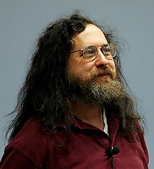
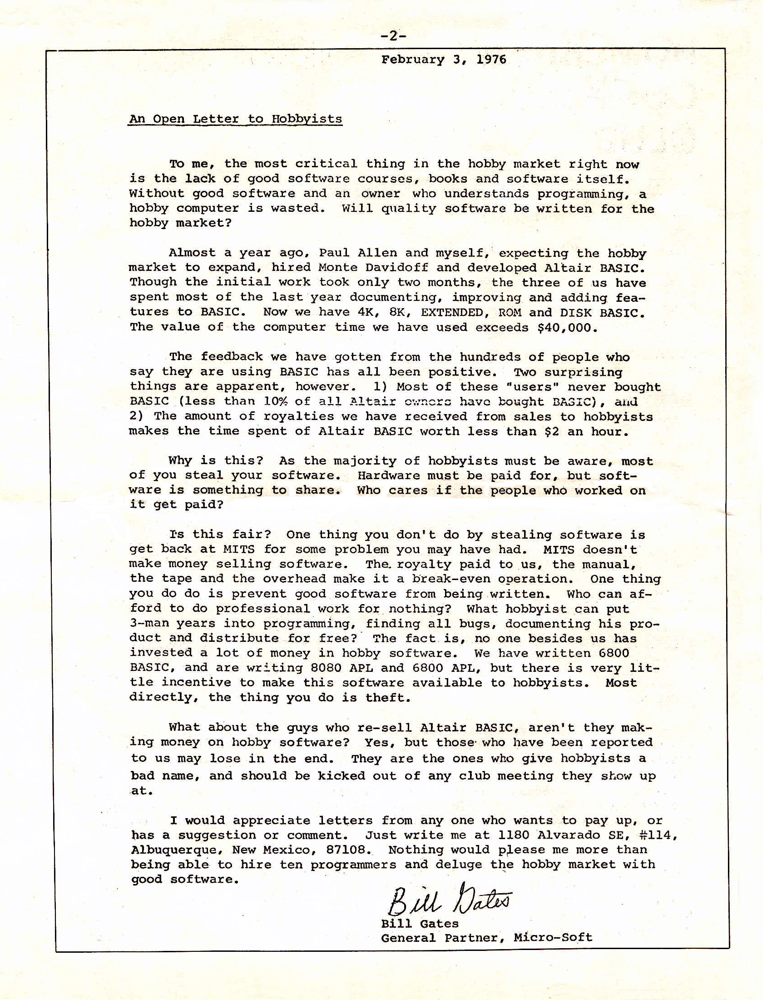

# História 

## O início do movimento do Software Livre

O software livre como conhecemos hoje não seria possível graças a diversas pessoas (que serão ainda citadas), mas, a fundação da [Free Software Foundation (FSF)](https://www.fsf.org/) em 1985 foi fundamental para a existência de uma filosofia que perpetua até hoje no movimento do software livre, a mesma filosofia que Richard Stallman (sim, o cabeludo na foto acima) tinha. Mas afinal, o que levou o surgimento deste movimento? Vamos descobrir...

Voltando um pouco mais no tempo, exatamente na década de 60, na qual o software ainda era distribuído com seu código-fonte sem nenhuma restrição em específico. Em 1969 o RFC (Request for Comments e futuramente se tornando ARPANET) que descreveria a primeira Internet foi publicado. Ken Thompson e Dennis Ritchie desenvolveram uma versão simplificada do MULTICS, sendo batizado por Brian Bernighan de UNICS e logo depois Unix, um sistema operacional multi-tarefas e multi-usuarios (já ouviu esse nome em algum lugar?). 

Os computadores eram vendidos geralmente incluindo tanto hardware quanto software, mas, neste mesmo momento da história a evolução constante dos sitemas operacionais e compiladores fez com que os custos sobre o valor de um software aumentassem drasticamente, por isso, em 1970 a IBM (na época a maior vendedora e produtora de computadores de grande porte) anunciou que iria vender softwares separados de hardwares, trazendo para a década de 70 um conceito nunca antes visto, na qual o software era comumente vendido como um "prduto de prateleira". 

Desde 1972 o Unix está em contínuo desenvolvimento e serviu como base em diversos sistemas operacionais variantes, sendo comercializados em diversas empresas. Sua filosofia de compartilhamento e ótima relação com centros de pesquisas e universidades fez com que se tornasse cada vez mais popular entre diversos desenvolvedores. O Unix, até então regido pela AT&T Bell Labs teve uma grande mudança de mentalidade após alguns acontecimentos.

- Em 1970 surge o ARPANET, sendo vendido pela IBM.
- Em 1972 houve a tentativa de reescrita do Unix com a linguagem B, daí melhorando-a devido à necessidades surge a linguagem C.
- Em 1973 surge o Unix BSD com a chegada do Unix à Universidade de Berkeley; 
- Em 1976 Bill Gates escreve a chamada [Carta Aberta aos Hobistas](https://upload.wikimedia.org/wikipedia/commons/1/14/Bill_Gates_Letter_to_Hobbyists.jpg/), na qual era descrito que esta prática de "compartilhamento de software não era justa" e "evitava que o software bem feito fosse escrito".

Então, em 1979 a AT&T começa a forçar licenças restritivas ao decidir que poderia lucrar com o sistema Unix, fazendo com que em 1980 sugissem os primeiros movimentos organizados em busca do chamado Software Livre.

- 1981 foi o ano em que a IBM fechou acordo com a Microsoft para fornecimento do DOS para PC, ainda desconsiderando sua evolução e abrindo mão dos direitos autorais do DOS, fazendo com que a Microsoft pudesse se expandir futuramente.

1983 foi o ano que Richard Stallman publicou uma mensagem no grupo "net.unix-wizards" com o seguinte assunto: "New Unix implementation", anunciando a criação do projeto GNU e seus princípios (GNU seria um acrônimo para "**G**NU's **N**ot **U**nix"), declarando a necessidade da criação de um "novo Unix", mencionando a necessidade de diversas ferramentas, por isso, pedindo o apoio em contribuições.

Em 1984 Stallman pediu demissão do AI Lab do MIT, se dedicando totalmente ao [Projeto GNU](https://www.gnu.org/), publicando o Manifesto GNU (que cita o termo "software livre" e descreve pontos a serem abordados). O primeiro software a ser publicado pelo Projeto GNU foi o chamado [GNU Emacs](https://www.gnu.org/software/emacs/), escrito por Richard Stallman e Guy L. Steele.

Em 1985 o sistemas de janelas X foi distribuído como software livre pelo Consórcio X, seguindo da fundação da Free Software Foundation e a publicação das chamadas "Quatro liberdades de um Software Livre", sendo elas:
- Liberdade 0: Liberdade de **executar** o programa como você desejar, para qualquer propósito;
- Liberdade 1: Liberdade de **estudar** como o programa funciona e adaptá-lo às suas necessidades (para isso o acesso ao código-fonte é essencial);
- Liberdade 2: Liberdade de **redistribuir cópias** de modo que você possa ajudar outros;
- Liberdade 3: Liberdade de **redistribuir cópias de suas versões modificadas**, dando a comunidade a change de beneficiar de suas mudanças (acesso ao código-fonte também é essencial);

As liberdades começam com a primeira sendo a "Liberdade 0", na qual foi expresso que seria como o "modo dos desenvolvedores começarem a contar", que seria do 0 (afinal, as linguagens de programação na época - C por exemplo - começavam a contar pelo 0, observe os arrays como um exemplo).

Ainda em 1985 o GCC (GNU C Compiler) teve sua primeira versão finalizada, sendo escrito por Richard Stallman e Len Towe. A definição oficial do que seria um "Software Livre" pode ser acessada clicando [aqui](https://www.gnu.org/philosophy/free-sw.pt-br.html).

Em 1987 Andrew Tanenbaum escreveu uma versão modificada do Unix para fins didáticos, denominada MINIX.

Em 1989 a Free Software Foundation criou o conceito de "copyleft" (sim, como se fosse o contrário de "copyright") e a Licença GNU GPL (General Public License) que garantia as 4 liberdades do software. O principal "esquema" dessa licença para garantir que o software fosse realmente público era que o software pertencia a X, e este X não permitiria qualquer venda do software, respeitando as diretrizes das 4 liberdades. Basicamente poderíamos dizer que fizeram com que o software ficasse "amarrado" ao pertencente e que este pertencente exigiria que este software respeitasse as liberdades (jogada de mestre não é?).

Ainda em 1989:
- Michael Stonebreaker lançou o [PostgreSQL](https://www.postgresql.org/) como software livre;
- A Cygnus (fundada por Michael Tiemann, David Henkel-Wallace e John Gilmore) se tornou a primeira empresa que essencialmente começou a prover serviços para software livre;
- Inicia-se o desenvolvimento do Network Simulator (NS), um simulador de rede de telecomunicações livre. Por meio do advento do Usenet a comunidade se tornou mais unida e expandiu o seu contato para diversos programadores de maneira simples, na qual poderiam compartilhar seus softwares.

## Linux 

O ano era 1991, o projeto GNU estava avançando cada vez mais, seu sistema operacional estava quase completo, mas, ainda dependia de parte do Kernel que o Unix fornecia, até que um estudante finlandês da Universidade de Helsinki publicou uma mensagem mencionando que estava projetando um sistema livre similar ao Minix, na qual obteve ajuda de diversos desenvolvedores de diversas partes do planeta. Esse era o primeiro sinal de que a construção de um sistema operacional totalmente livre era possível, e isso fez com que os integrantes do projeto GNU (ainda mais Richard Stallman) se interessassem pelo projeto. O nome desde estudante era Linus Torvalds (sim, o cara da foto acima), e com apenas 21 anos cursando sua pós-graduação começou a fazer experimentos em seu computador 386, na qual conseguiu fazer com que seu projeto de Kernel executasse concorrentemente dois programas, por isso, realizou um anúncio na Internet que já conseguira seu primeiro protótipo.

Em março de 1984 a primeira versão estável foi publicada (a chamada versão 1.0), na qual durante todo o período de desenvolvimento centenas de desenvolvedores se juntaram para integrar todo o sistema GNU no kernel de Linus, nomeado como Linux (um acrônimo para Linus's Minix, Linus's Unix ou até mesmo **L**inux **i**s **N**ot **U**ni**x**).

Diversos componentes do kernel Linux foram distribuídos sob licença GNU GPL, e esta falta de um núcleo completo livre havia finalizado para o projeto GNU publicar seu sistema operacional GNU/Linux, no qual Linus Torvalds havia completado.

Torvalds disse que não queria dinheiro por uma série de razões, mas, que seu principal intuito era pelo sentimento de que estava "seguindo os passos de centenas de ciencistas e acadêmicos", afinal, as pessoas contruíram seu trabalho "apoiando-se nos ombros de gigantes".

Em 1992 surgiram as primeiras distribuições GNU/Linux como SLS que posteriormente se tornou Slackware (que ainda tem suporte até os dias atuais). Em 1993 tivemos a distribuição Debian sendo lançada com apoio da FSF, iniciada por Ian Murdock e tem suporte até os dias atuais, servindo como base de diversas outras como Ubuntu, Mint, entre outras.

Hoje o GNU/Linux permanece como software livre sob os termos da GNU GPL, porém, diversas empresas utilizam dele para oferecer produtos ou suporte técnico profissional. Ainda há controvérsias sobre o uso do nome Linux e GNU/Linux, na qual argumentam que GNU/Linux seria para um sistema totalmente livre, mas, isso é outra história...

---

Agora que você já entendeu sobre a história do início do movimento do software livre, vamos estudar um pouco sobre licenças e como elas funcionam!

  <a href="https://github.com/lanjoni/lpi4noobs/blob/main/content/intro/licencas.md">Próximo -> Licenças</a>

  <a href="https://github.com/lanjoni/lpi4noobs#roadmap">Voltar para o menu principal</a>

