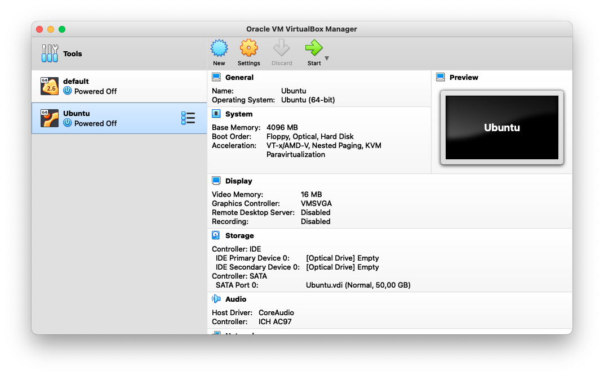
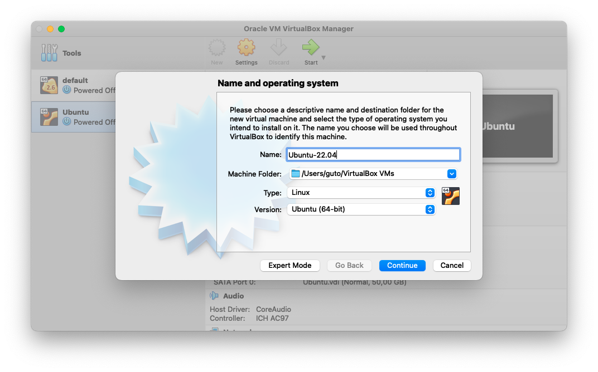
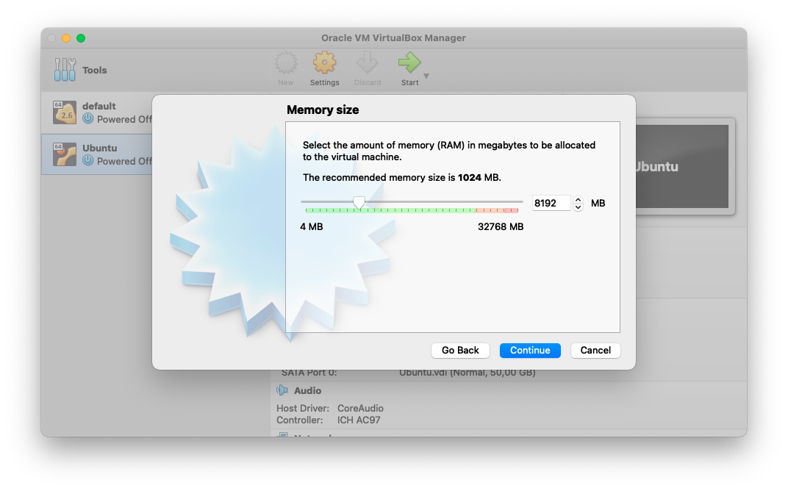
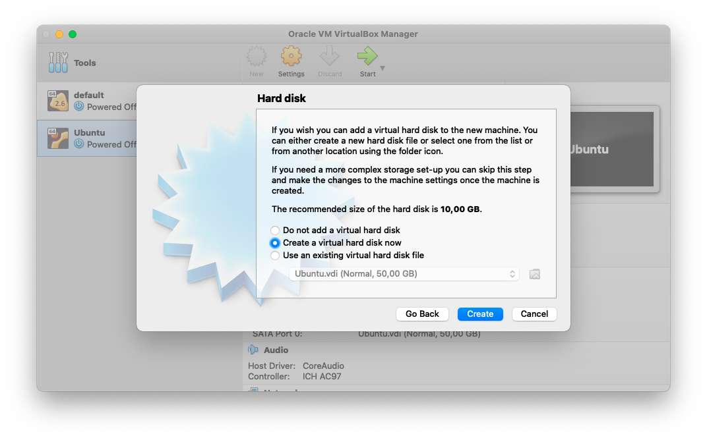
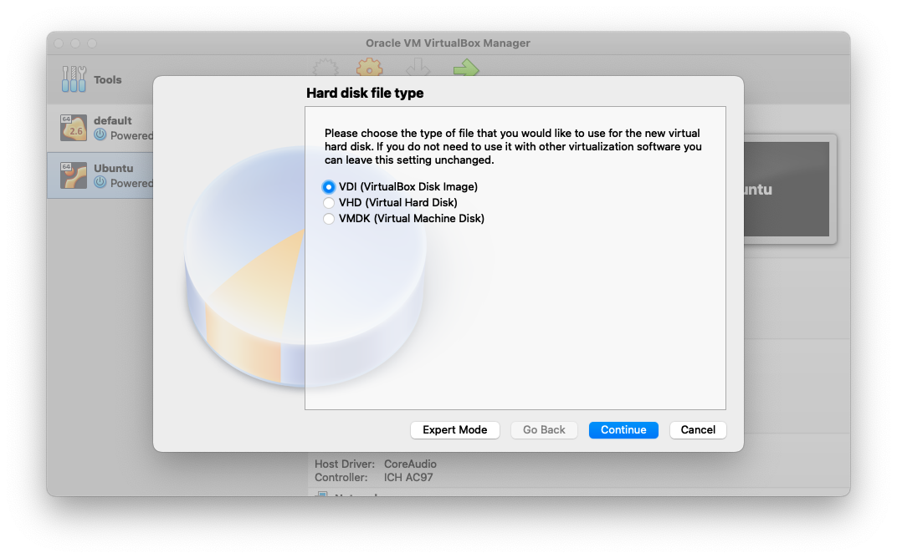
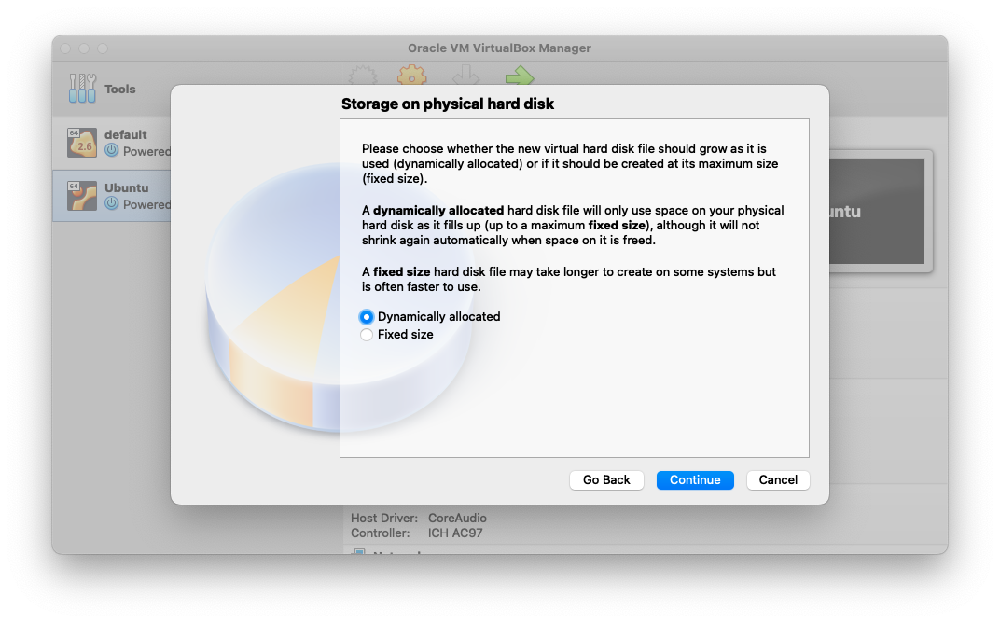
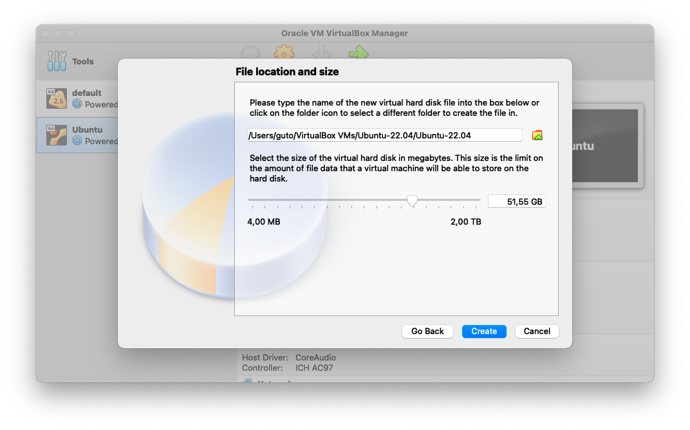
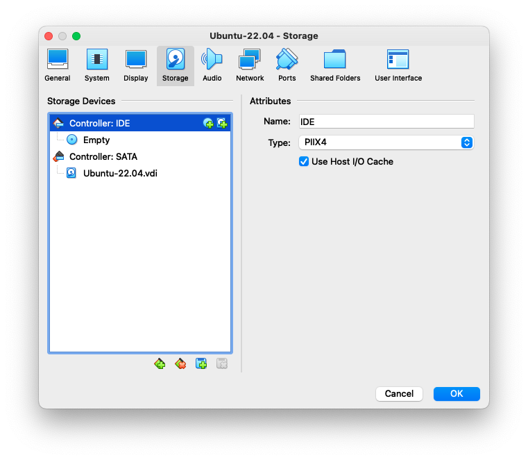
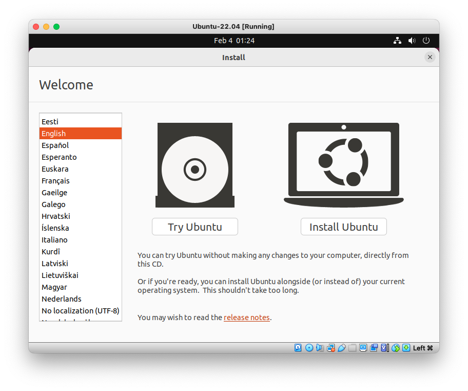

# Instalação do Linux

Agora chegou o momento aguardado por muitos: colocar a mão na massa! Caso você já tenha um ambiente Linux configurado saiba que já pode passar para o próximo capítulo! Nesta etapa iremos configurar todo um ambiente utilizando uma máquina virtual para rodar nossas brincadeiras!

**Atenção:** se você estiver utilizando WSL no Windows saiba que pode pular para o próximo capítulo caso não queira configurar uma máquina virtual à parte! O detalhe em específico é com questões sobre interfaces gráficas que você não poderá testar em si, mas não se preocupe, não irá atrapalhar seu aprendizado!

## Instalação do VirtualBox

Sim, iremos utilizar o VirtualBox para nossa configuração! O motivo é simples: a customização dele é excelente e interativa, na qual podemos ter diversas máquinas virtuais, além de ser multi-plataforma! Você pode instalar estando tanto no próprio Linux, quanto no seu macOS, Windows ou até mesmo alguma variação de BSD!

Para acessar o menu de instaladores basta clicar <a href="https://www.virtualbox.org/wiki/Download_Old_Builds_6_1">aqui</a>. Vamos utilizar alguma variação da versão 6, o motivo é: a mudança de interface da versão 6 para 7 pode ocasionar alguns problemas em configurações específicas, por isso, recomendo que baixe pelo link de acordo com seu sistema operacional e realize a instalação normalmente, sem segredo!

## Escolha da sua distribuição

Como nosso exemplo será voltado para o uso do Linux em si de forma genérica, a escolha de uma distribuição não vai afetar tanto, afinal, vamos utilizar muito mais o terminal. Recomendo alguma distribuição baseada no Debian (Ubuntu, Linux Mint, entre outros), Red Hat (Fedora ou CentOS), e até mesmo o Arch (Manjaro, Artix entre outros). O ponto é: vamos estudar os seus funcionamentos de forma geral, além de estudar sobre seus gerenciadores de pacotes. 

No meu caso, irei utilizar o Ubuntu, na qual você pode baixar uma imagem clicando <a href="https://ubuntu.com/download/desktop">aqui</a>. Não existe uma distribuição certa, apenas a que mais lhe agrada. Neste caso utilizarei o Ubuntu porque creio que seja a distribuição que a maioria já ouviu falar.

Após baixar a ISO de sua distribuição podemos configurar no VirtualBox. Irei referenciar minha distro como Ubuntu, mas, você poderá referenciar a sua como preferir!

## Configuração no VirtualBox

O primeiro passo após abrir o VirtualBox é criar nossa máquina! Pra isso, clique em "Novo", um botão azul na parte inferior:

Agora, vamos escolher um nome para nossa máquina e selecionar qual tipo de Sistema Operacional ela é (neste caso um Linux, sendo no meu caso um Ubuntu 64 bits):

Neste momento vamos selecionar quanto de memória iremos disponibilizar para nossa máquina virtual. Caso seu PC tenha 8GB, 3GB é suficiente. Se seu PC tiver 16GB ou mais, 6GB é suficiente. Um detalhe importante é: este valor pode ser alterado a qualquer momento na página de configuração da nossa máquina.

Aqui vamos criar um novo "disco" reservado para nossa máquina, seu tipo será dinamicamente alocado, assim a alocação de espaço varia conforme utilizarmos nosso sistema.

Em meu caso reservei 50GB, mas saiba que 20GB já é suficiente!

Agora já estamos com nossa máquina criada! Lembra daquela ISO que eu havia pedido para vocês fazerem o download? Com ela vamos inicializar nossa máquina, assim vamos instalar a distribuição! Para isso basta selecionar o nome de nossa máquina e depois clicar na aba de configurações (uma engrenagem):

Bom, basta selecionar a aba de discos, clicar no "Mini CD" para adicionar um novo disco.

Vamos clicar em adicionar para importarmos nosso disco baixado anteriormente, deixar selecionado e escolher o disco! Depois disso podemos voltar para a página inicial do VirtualBox e clicarmos no botão verde para iniciarmos nossa máquina!

Após chegar nesta tela basta você seguir o tutorial de instalação e realizar toda a configuração como desejar, adicionando senhas e escolhendo seu nome!

---

Muito bem! Agora que já configuramos nosso VirtualBox e nossa máquina virtual estamos prontos para começar com nossas atividades práticas! Bora lá conhecer um pouco de nossa distribuição?

  <a href="https://github.com/lanjoni/lpi4noobs/blob/main/content/intro/conhecendo.md">Próximo -> Conhecendo a distribuição</a>

  <a href="https://github.com/lanjoni/lpi4noobs#roadmap">Voltar para o menu principal</a>

