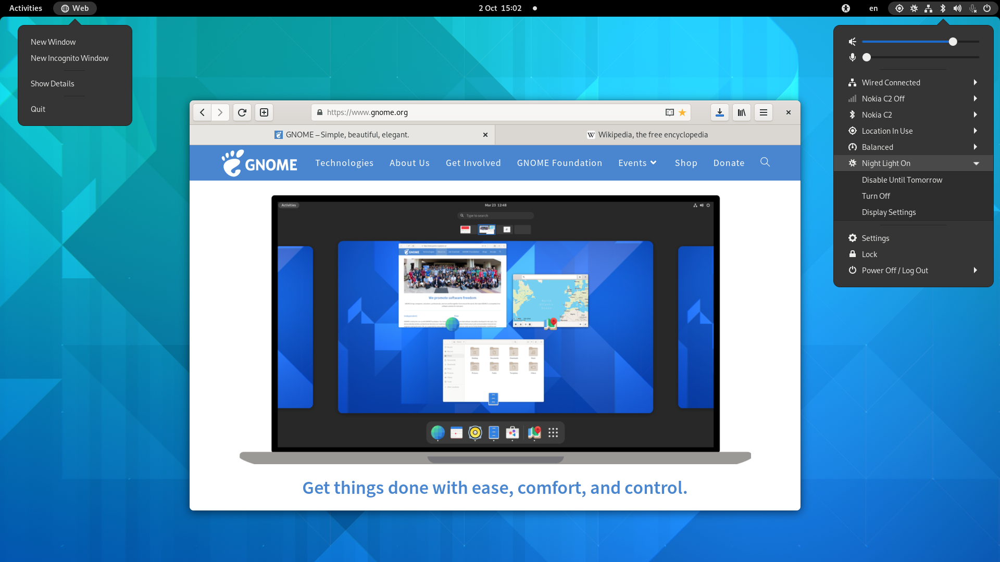
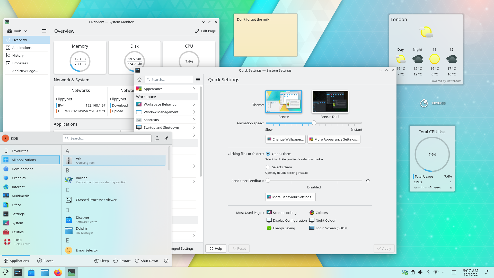
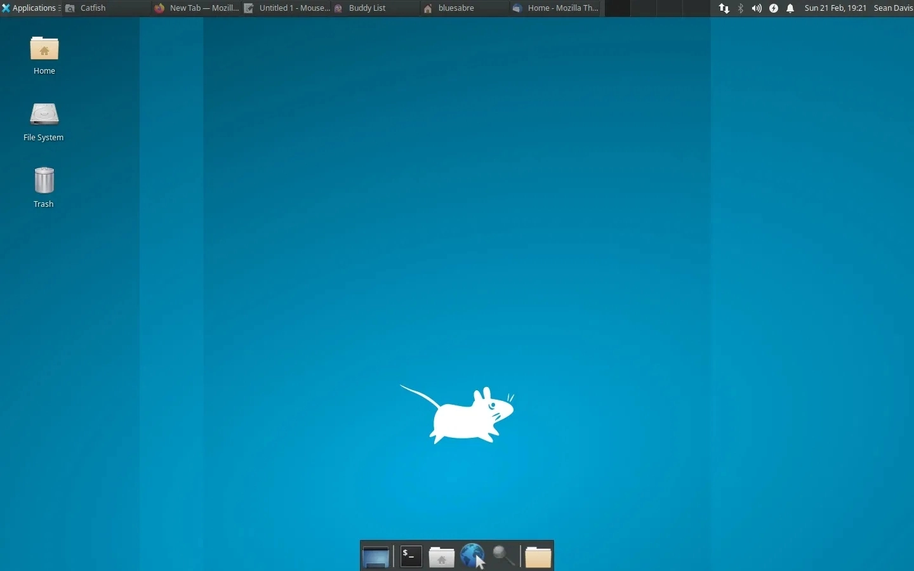
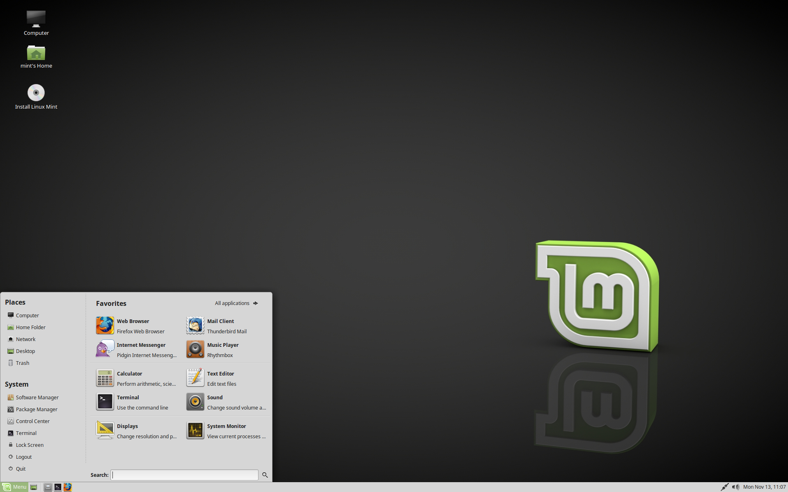

# Interfaces gráficas

O uso de interfaces gráficas é o que muitas das vezes caracteriza cada distribuição, mas, podemos dizer que conseguimos utilizar qualquer interface gráfica com praticamente todas as distribuições, isto é: se você utiliza Fedora, por mais que ele venha com o GNOME instalado você consegue instalar o XFCE, por exemplo. Essa praticidade e personalização faz com que as distribuições possam ser o que são hoje, por isso, vamos conhecer algumas interfaces gráficas!

## Gnome 

Surgindo em 3 de março de 1999, o ambiente de trabalho e interface gráfica é mantido pelo Projeto GNOME, mas, foi originalmente criado em 15 de agosto 1997 pelos mexicanos Miguel de Icaza e Federico Mena Quintero, como uma "resposta" ao Windows 95, aprimorando o GTK, um conjunto de ferramentas usado pelo editor de imagens GIMP.

Atualmente o GNOME está em sua versão estável 43, sendo escolhido por diversas distribuições como interface gráfica padrão, tais como Ubuntu e Fedora, por exemplo.

<figure align="center">
  
  <figcaption>Ambiente de trabalho utilizando GNOME 41.</figcaption>
</figure>

## KDE 

Originalmente uma comunidade internacional de software livre fundada em 14 de outubro de 1996, o KDE produz um conjunto de aplicativos além da interface gráfica Plasma multiplataforma tão querida por muitos, incluindo softwares projetados para funcionar em distribuições Linux, FreeBSD, Solaris, Microsoft Windows e até mesmo Apple macOS e Mac OS X. O KDE e seus aplicativos são escritos com o framework Qt.

KDE era uma sigla inglesa para "K Desktop Environment", sendo o "K" escolhido por ser a letra anterior a "L" de Linux, mas, em 2009 deixaram o nome por extenso e passou a ser chamada simplesmente de "KDE". Matthias Ettrich é o fundador do KDE.

Atualmente temos o uso do KDE Plasma 5, lançado em 2014, seis anos após o lançamento do KDE Plasma 4.

<figure align="center">
  
  <figcaption>Ambiente de trabalho utilizando KDE Plasma 5.</figcaption>
</figure>

## XFCE 

Tendo seu lançamento em 1996, sendo um projeto fundado por Oliver Fourdan, o ambiente de trabalho XFCE é leve, simples, rápido e executado sobre o sistema de janelas X em sistemas Unix-like e Unix-based, na qual utiliza a biblioteca GTK a partir da GTK+2. Utiliza o gerenciador de janelas XFWM.

O XFCE é utilizado por diversos usuários de Linux em todo o mundo, sendo conhecido mundialmente por ter essa perspectiva de simplicidade e velocidade em uma interface gráfica. Sua modularidade permite que seus componentes podem ser utilizados em outros ambientes, podendo utilizar aplicações do XFCE em interfaces como o GNOME e o KDE sem muitos problemas.

Atualmente temos o uso do XFCE em sua versão 4, mais especificamente 4.18.

<figure align="center">
  
  <figcaption>Ambiente de trabalho utilizando XFCE 4.</figcaption>
</figure>

## MATE 

O MATE é um ambiente de trabalho baseado no GNOME, sendo criado devido à mudança que o GNOME 3 teve, na qual não agradou a todos. Seu nome é inspirado na erva-mate (e no chimarrão, claro), sendo anunciado em junho de 2011 no fórum do Arch Linux. Foi desenvolvido por Perberos, Stefano Karapetsas, Clement Lefebvre e Steve Zesch.

Utilizando a biblioteca GTK+3 desde a versão 1.18, atualmente estamos na versão 1.26 do MATE. Os projetos Ubuntu MATE e Linux Mint são apoiadores do MATE.

<figure align="center">
  
  <figcaption>Ambiente de trabalho utilizando MATE 1.20.</figcaption>
</figure>

## Bônus

Existem ainda diversas interfaces gráficas que podem ser instaladas, assim como ambientes que possuem apenas gerenciadores de janelas, os famosos *tiling window managers* ou *dynamic window managers*, como é o caso dos projetos <a href="https://i3wm.org/">i3wm</a> e <a href="https://dwm.suckless.org/">dwm</a>, por exemplo.

Não irei entrar em muitos detalhes, mas, recomendo darem uma lida depois para entender como é seu funcionamento e produtividade, além de serem extremamente leves.

Para lerem um pouco mais e conhecerem outras interfaces acesse o blog do Tecmint e descubra mais possibilidades clicando <a href="https://www.tecmint.com/best-linux-desktop-environments/">aqui<a/>!
  
---

Excelente! Conseguimos concluir nossa introdução completa sobre o mundo Linux, na qual falamos sobre a história do Linux em si, funcionamento de licenças, apresentações de distribuições e interfaces, além de configurarmos uma máquina virtual para realizarmos nossos futuros estudos! Bora para as aulas utilizando o Linux?

  <a href="https://github.com/lanjoni/lpi4noobs/blob/main/content/conceitos">Próximo -> Conceitos</a>

  <a href="https://github.com/lanjoni/lpi4noobs#roadmap">Voltar para o menu principal</a>

