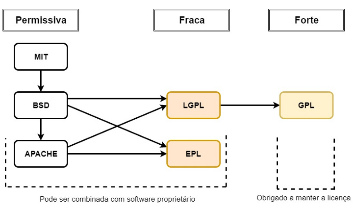

# Licenças

## O que são licenças?

Licenças são as limitações que um software pode possuir em seu uso com relação ao usuário. Basicamente podemos dizer que as licenças são responsáveis por definir até onde o usuário pode ir utilizando um determinado software. Sua importância é na determinação dos direitos de propriedade de um software, isto é, definir claramente o que o usuário pode fazer com aquele software.

Podemos ainda dizer que determinadas licenças trabalham com um conceito de contrato para permissões de uso entre o fornecedor do software e o usuário.

Entender sobre o uso das licenças é essencial para diferenciarmos algo que por muitos é confundido: Software Livre e Software de Código Aberto (Open-Source).

## Software Livre x Software de Código Aberto

Uma licença que já falamos anteriormente é a licença GNU GPL (que atualmente está em sua versão 3.0), caracterizada por ser uma licença de software livre e garante para o usuário às quatro liberdades do software livre que foram comentadas anteriormente. Para garantir total liberdade de uso existe o conceito de "copyleft", do qual um software é totalmente livre de direitos autorais sobre o software, garantindo domínio público para seu uso, mas, com direitos quanto à propriedade intelectual do portador do software.

Uma licença de código aberto garante que o código-fonte de um software seja aberto, mas, permite custos para modificações, manutenção, entre outros serviços que podem ser prestados sob o uso do software em si, atrelados à algum determinado produto. 

Podemos dizer que todo Software Livre é Software de Código Aberto, afinal, uma de suas requisições para ser livre é ter seu código-fonte aberto, mas, nem todo Software de Código Aberto é Livre.

## Algumas licenças
### GNU GPL (GNU General Public License)
- O código-fonte **deve** ser público e de domínio público.
- Modificações no código **precisam** ser lançadas sob a mesma licença.
- Toda mudança **deve** ser documentada.
- Alguns projetos sob licença GNU GPL: Bash, GIMP, entre outros distribuídos pelo Projeto GNU.

### Apache
- O código-fonte não precisa ser público.
- Modificações podem ser lançadas sob qualquer licença.
- Mudanças no código **precisam** ser documentadas.
- Proíbe o uso de nomes de marcas registradas encontradas no projeto.
- Alguns projetos sob licença Apache: Android, Apache e Swift.

### BSD (Berkeley Software Distribution)
- O código-fonte não precisa ser público.
- Modificações podem ser lançadas sob qualquer licença.
- Mudanças feitas no código não precisam ser documentadas.
- Uso de patentes não é explícito.
- Nomes dos autores e colaboradores não podem ser usados para promover produtos derivados do software sem permissão explícita.
- Alguns projetos sob licença BSD: Go, Pure.css e Sentry.

### MIT
- O código-fonte não precisa ser público.
- Modificações podem ser lançadas sob qualquer licença.
- Mudanças feitas no código não precisam ser documentadas.
- Uso de patentes não é explícito.
- Alguns projetos sob licença MIT: jQuery, Bootstrap e Rails.

### Diagrama para compreendimento do funcionamento das licenças

> Atenção: Para construir este exemplo utilizei de uma publicação do autor <a href="https://medium.com/code-prestige/como-funcionam-as-licen%C3%A7as-open-source-9ff1da677ccd">Diego Martins de Pinho</a> sobre o funcionamento das licenças.

---

Agora que você já entendeu o funcionamento das licenças e seus tipos de permissionamentos o que acha de colocarmos a mão na massa e prepararmos um ambiente virtual para aprendermos um pouco mais sobre Linux?

  <a href="https://github.com/lanjoni/lpi4noobs/blob/main/content/intro/instalacao.md">Próximo -> Instalação do Linux</a>

  <a href="https://github.com/lanjoni/lpi4noobs#roadmap">Voltar para o menu principal</a>

