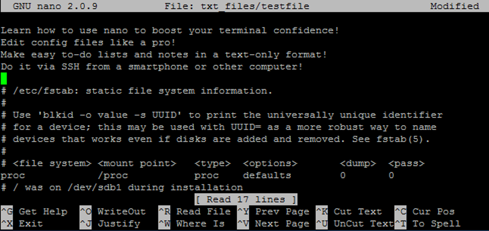
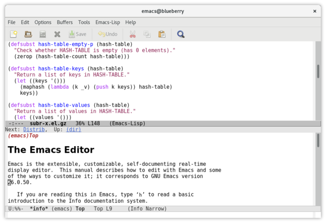
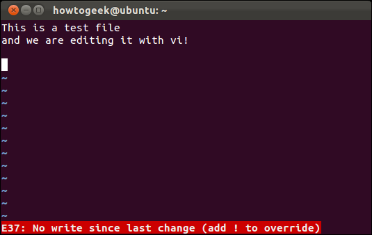
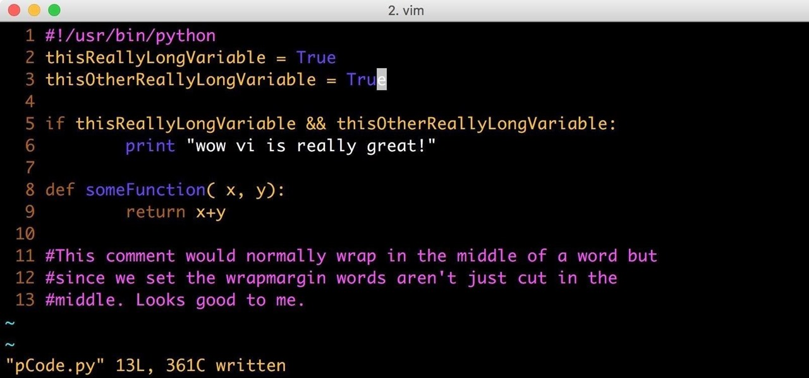

# Edição de arquivos

A edição de arquivos pode ser feita de diversas maneiras utilizando um sistema Linux, por isso, vamos destacar algumas, mas, em sua maioria editores que funcionam no próprio terminal, sendo que para aqueles que gostam de se aventurar na tecnologia e costumam programar, saiba que existem editores específicos para estas tarefas, na qual configurados corretamente podem aumentar **muito** a sua produtividade. Bora conhecer alguns?

## Gedit

Um editor de texto compatível com interface gráfica do projeto GNOME, o "gedit" possui funcionalidades semelhantes ao que temos no windows como um "bloco de notas", sendo possível de ser acessado via interface gráfica, podendo ser instalado ou não, mas, suportando diversas funcionalidades e até mesmo suportando "text highlighting" em algumas linguagens de programação por padrão. Para utilizar basta executar o comando `gedit nome_do_seu_arquivo`!

Sua primeira versão surgiu em 12 de fevereiro de 1999!

## GNU Nano

Surgindo em 1999, mas fazendo parte do projeto GNU a partir de 2001, o GNU Nano é um editor de texto que, atualmente, está presente por padrão na maioria das distribuições Linux, utilizado totalmente via terminal, sendo leve e prático para permitir que o usuário possa realizar simples modificações em textos ou até mesmo editar códigos. Para utilizar basta executar o comando `nano nome_do_seu_arquivo`!

Sua sintaxe é bem simples e intuitiva, afinal, existe um menu na barra inferior demonstrando as funcionalidades, dentre elas o famoso "salvar e sair" pode ser feito apertando `CTRL + O` para salvar e `CTRL + X` para sair!

## GNU Emacs

Surgindo em 1985 sendo baseado no antigo Emacs (**E**ditor **MAC**ro**S**) de 1976, o GNU Emacs foi portado por Richard Stallman em 1984 e tendo sua primeira release um ano depois, possibilitando algumas modificações que evolviam scripts específicos em C e LISP, sendo a primeira alternativa de software livre para o Gosling Emacs. Originalmente pode ser utilizado via terminal, mas, podemos utilizá-lo em um ambiente separadamente!

## VI

Tendo seu primeiro release em 1976, o "vi" ficou muito famoso na época por ser um editor prático, simples, leve, intuitivo e que possuia um suporte para funcionalidades específicas diretamente no terminal, possibilitando sua popularização! Podendo ser utilizado para edições simples e edições específicas, o vi pode estar ou não presente por padrão em sua distribuição, sendo necessário utilizar o comando `vi nome_do_seu_arquivo` para começar a utilizar!

O famoso "salvar e sair" que muitos brincam sobre "necessitar de forçar o desligamento do PC para sair do VI" pode ser feito de forma simples:
- Tecle a letra `i` para entrar no modo de inserção de texto;
- Após acabar de inserir textos, aperte `esc` para voltar para o modo de comandos;
- Agora digite `:wq`, na qual os dois pontos ":" indicam um comando a ser digitado, "w" para salvar (escrever - write - traduzido) e "q" para sair (quit - traduzido);

> Para forçar uma saída adicione um sinal de exclamação "!" ao final de todos os comandos! Para forçar um "salvar e sair" seria algo como `:wq!`.

Simples não é?

## VIM

O VIM, também conhecido como "**V**i **IM**proved", é um editor de texto que pode ser utilizado também via terminal. Sua primeira release foi em novembro de 1991, sendo adorado por muitos e utilizado até mesmo hoje por suas funcionaliades, suporte e comunidade, além de trazer diversos benefícios do vi como sua simplicidade e leveza.

O VIM trouxe um conceito de plugins e customização de atalhos, fazendo com que pudesse ser altamente customizável utilizando o chamado "Vim Script". Para editar um arquivo utilizando o VIM basta usar o comando `vim nome_do_seu_arquivo`. Geralmente o VIM pode estar instalado por padrão em diversas distribuições.

> Existem diversos editores de texto baseados no VIM que são muito famosos e intuitivos também, como o <a href="https://neovim.io/">Neovim</a>, que pode ser customizado utilizando tanto o Vim Script quanto linguagens como Lua para manusear melhor as configurações.

Os comandos são os mesmos do vi para salvar e sair, além de possuir outras funcionalidades parecidas!

---

Excelente! Agora que você já conheceu alguns editores de texto que podem ser facilmente encontrados no mundo do software livre, o que acha de estudarmos um pouco sobre o funcionamento de compactação e compressão de arquivos?

  <a href="https://github.com/lanjoni/lpi4noobs/blob/main/content/pratica/compressao.md">Próximo -> Compressão</a>

  <a href="https://github.com/lanjoni/lpi4noobs#roadmap">Voltar para o menu principal</a>

